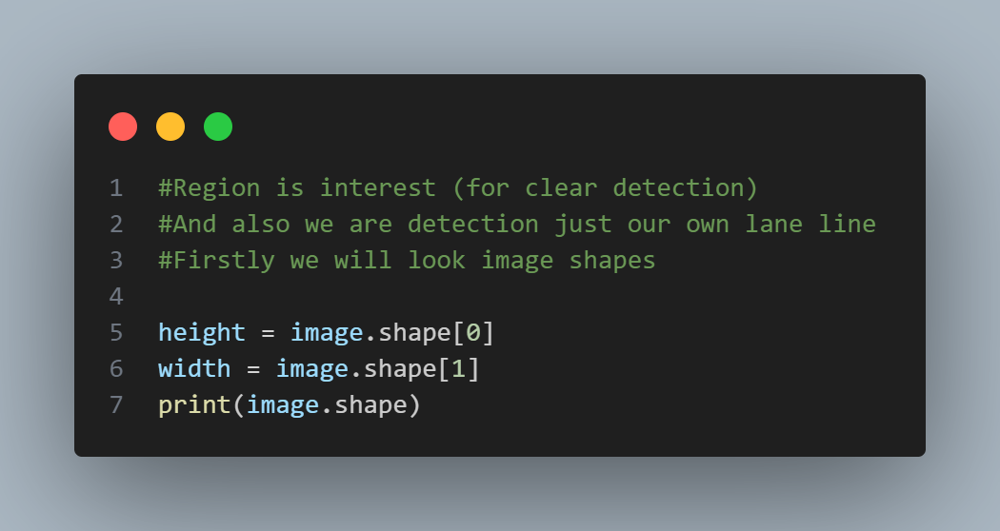
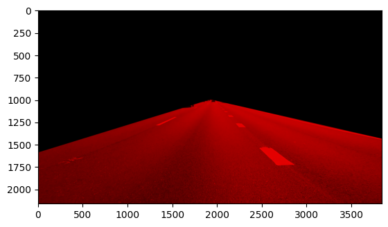
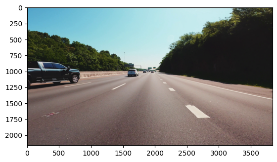
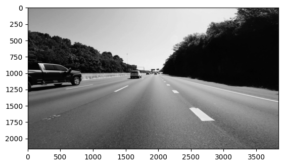
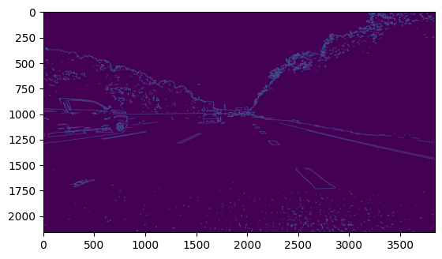
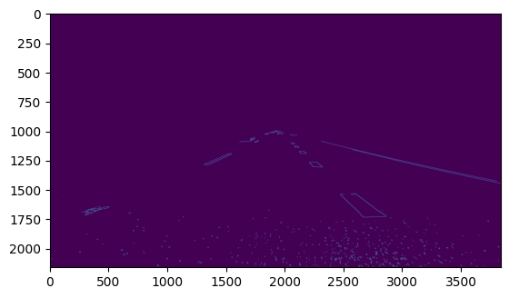

# Görüntü İşleme İle Şerit Tespit Sistemi

  
  
  

  
  

## Proje Hakkında

Bu proje, görüntü işleme teknikleri kullanarak, özellikle yol şeritlerinin doğru bir şekilde tespit edilmesine odaklanan bir sistemin oluşturulmasını amaçlamaktadır. Sistem, bir video kaydından veya canlı yayından alınan görüntüleri analiz ederek yol şeritlerini tespit eder ve bu şeritleri görsel olarak işaretler. Bu proje, şerit tespiti için modern görüntü işleme yöntemlerinin uygulamalarını incelemektedir.

• **Hedef**: Yol şeritlerini doğru bir şekilde tanımlamak ve takip etmek. Bu, özellikle otonom araç sistemleri için çok önemlidir.

• **Teknikler**: OpenCV, Matplotlib gibi popüler kütüphaneler kullanılarak, görüntü işleme adımları gerçekleştirilmiştir.

• **Model Durumu**: Proje, belirli bir model eğitimi içermemektedir; yalnızca görüntü işleme adımlarını içeren temel bir uygulamadır.

<h2>📋 Proje Adımları</h2>

<h3>1. Videodan Görüntü Alınması</h3>

Videodan analiz için bir kare görsel alınır. Bu görselin alınma amacı, videoda çalışması için işlemleri ayarlamaktır.

• Bu adım, gerçek zamanlı video akışlarından veri almak için temel bir adımdır.  

<h3>2. BGR'den RGB'ye Dönüşüm</h3>

OpenCV BGR formatında okuduğu görselleri, Matplotlib ile doğru görüntülemek için RGB formatına dönüştürüyoruz.

• Görüntülerin doğru bir şekilde görselleştirilmesi için renk formatı dönüştürülür.  

<h3>3. Görüntü Boyutlarının Belirlenmesi</h3>

Görselin boyutları belirlenerek analiz yapılır.

• Görüntünün genişlik, yükseklik ve kanal sayısı hesaplanır. Bu, sonraki işleme adımlarının doğru uygulanabilmesi için önemlidir.  

<h3>4. Görselin Kesilmesi (ROI)</h3>

Şeritlerin bulunduğu bölgeye odaklanmak için görsel kesilir.

• Bu adımda, şeritlerin bulunduğu bölgeyi belirlemek ve gereksiz kısımları kesmek için ROI (Region of Interest) kesimi yapılır.  

<h3>5. Bulanıklaştırma ve görseli Gri Formata Dönüştürme</h3>

Görsel gri tonlamaya dönüştürülerek analiz kolaylaştırılır.

• Gri tonlama, görüntüdeki renk bilgilerini atarak sadece parlaklık bilgilerini kullanmaya olanak tanır. Bu, kenar tespiti gibi işlemleri kolaylaştırır.  

<h3>6. Kenar Tespiti (Canny Filtresi)</h3>

Canny algoritması kullanarak kenarlar belirlenir.

• Canny kenar algılama filtresi, görüntüdeki kenarları tespit etmek için kullanılır. Bu adım, şeritlerin sınırlarını net bir şekilde tanımlamamıza olanak tanır.  

<h3>7. Şerit Çizgilerinin Çizilmesi</h3>

Görselde tespit edilen kenarların üzerine şerit çizgileri çizilir.

• Şeritlerin tespitinden sonra, bu kenarlara şerit çizgileri eklenir, böylece yol üzerindeki şeritler net bir şekilde vurgulanır.

<h2>🎥 Çıktı</h2>

Projenin nihai çıktısı aşağıda gösterilmiştir.

<h2>🛠️ Kullanılan Teknolojiler</h2>
<ul>
  <li><strong>Python</strong> - Projenin ana programlama dili.</li>
  <li><strong>OpenCV</strong> - Görüntü işleme işlemleri için kullanılan kütüphane.</li>
  <li><strong>Matplotlib</strong> - Görselleri analiz etmek ve görselleştirmek için kullanılan kütüphane.</li>
</ul>

<h2>👨‍💻 Geliştiriciler</h2>

<strong>Furkan Hamza BOLAT</strong>

<strong>Email:</strong> <a href="mailto:furkanhamzabolat@gmail.com">furkanhamzabolat@gmail.com</a>

<strong>Furkan DAYI</strong>

<strong>Email:</strong> <a href="mailto:furkan.dyi@hotmail.com">furkan.dyi@hotmail.com</a>

