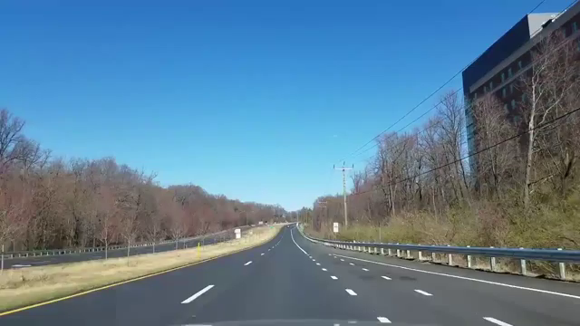
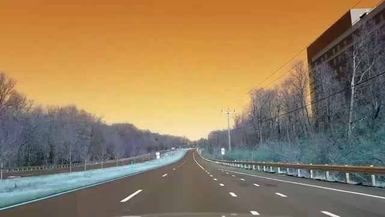
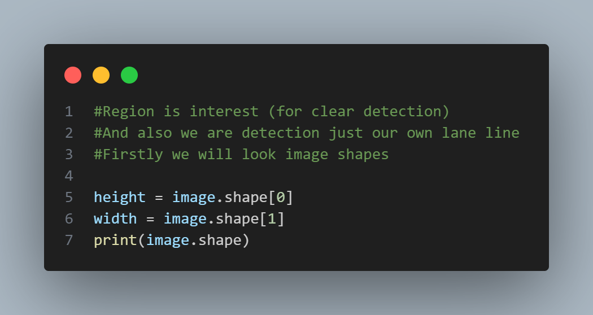
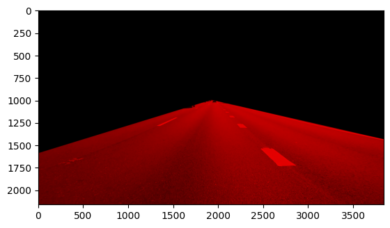
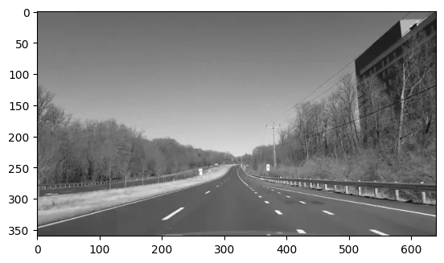
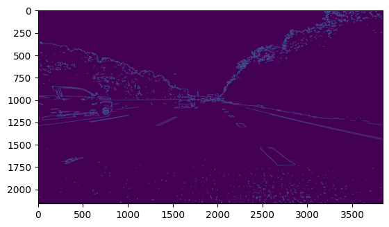
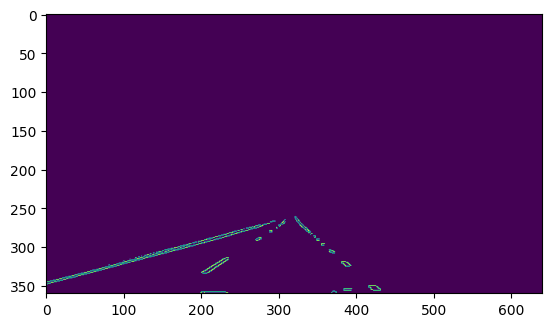

<header>
    <h1>Görüntü İşleme İle Şerit Tespit Sistemi</h1>
</header>

  
  
  

## Proje Hakkında
Bu proje, görüntü işleme teknikleri kullanılarak şerit tespit sistemi yapmayı amaçlamaktadır. Model eğitilmemiştir.
<section>
<h2>📋 Proje Adımları</h2>

<h3>1. Videodan Görüntü Alınması</h3>
- Videodan analiz için bir kare görsel alınır. Bu görselin alınma amacı, videoda çalışması için işlemleri ayarlamaktır.
- skjvşfsdv

<h3>2. BGR'den RGB'ye Dönüşüm</h3>

OpenCV BGR formatında okuduğu görselleri, Matplotlib ile doğru görüntülemek için RGB formatına dönüştürüyoruz.

<h3>3. Görüntü Boyutlarının Belirlenmesi</h3>

Görselin boyutları belirlenerek analiz yapılır.

<h3>4. Görselin Kesilmesi (ROI)</h3>

Şeritlerin bulunduğu bölgeye odaklanmak için görsel kesilir.

<h3>5. Görseli Gri Formata Dönüştürme</h3>

Görsel gri tonlamaya dönüştürülerek analiz kolaylaştırılır.

<h3>6. Kenar Tespiti (Canny Filtresi)</h3>

Canny algoritması kullanarak kenarlar belirlenir.

<h3>7. Şerit Çizgilerinin Çizilmesi</h3>

Görselde tespit edilen kenarların üzerine şerit çizgileri çizilir.

</section>

<section class="output-gif">
    <h2>🎥 Çıktı</h2>
    
Projenin nihai çıktısı aşağıda gösterilmiştir.

    
</section>

<section>
    <h2>🛠️ Kullanılan Teknolojiler</h2>
    

        <ul>
            <li><strong>Python</strong></li>
            <li><strong>OpenCV</strong> - Görüntü işleme</li>
            <li><strong>Matplotlib</strong> - Görsel analiz</li>
        </ul>
    

</section>

<section>
    <h2>📂 Projeyi Çalıştırma</h2>
    

        
Projeyi çalıştırmak için aşağıdaki adımları takip edebilirsiniz:

        <ol>
            <li>Projeyi klonlayın:  
                <code>git clone https://github.com/username/serit-tespiti.git</code>  
                <code>cd serit-tespiti</code>
            </li>
            <li>Gerekli kütüphaneleri yükleyin:  
                <code>pip install opencv-python matplotlib</code>
            </li>
            <li>Proje dosyasını çalıştırın:  
                <code>python main.py</code>
            </li>
        </ol>
    

</section>

<section>
    <h2>👨‍💻 Geliştiriciler</h2>
    
<strong>Adınız Soyadınız</strong>

    
<strong>Email:</strong> your-email@example.com

    
<strong>LinkedIn:</strong> <a href="https://linkedin.com/in/yourname" target="_blank">Profilinizi Ziyaret Edin</a>

</section>

<footer>
    
© 2024 Şerit Tespiti Projesi | Tüm Hakları Saklıdır

</footer>

</body>
</html>
